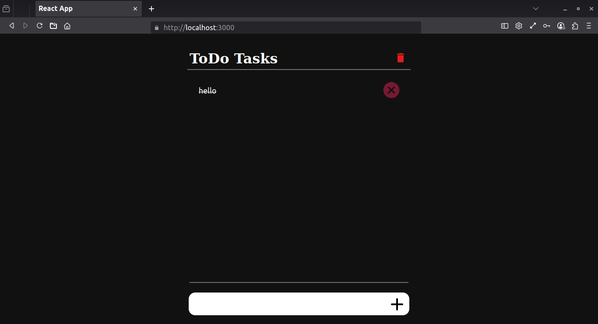
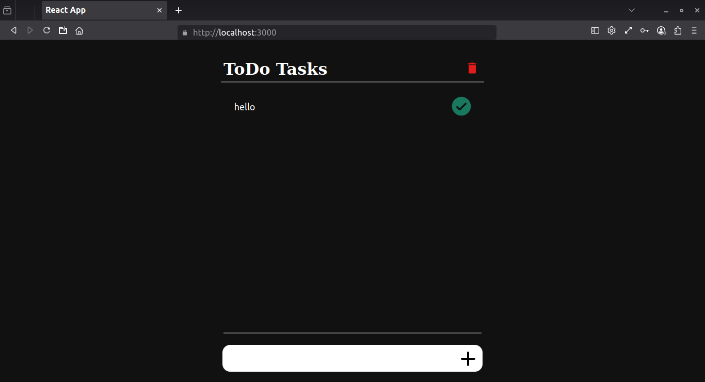

# Basic TODO app  
This is a minimal todo app created with react 
todos are stored inside localhost so the data will not be lost after refresh 

## install 

<pre>
  <code>
    git clone https://github.com/Akhilesh286/react.todo.tutorial.git
    cd react.todo.tutorial
  </code>
</pre>
<pre>
  <code>
    npm install
    npm start
  </code>
</pre>
open browser and go to http://127.0.1.1:3000/

## Screenshots 

